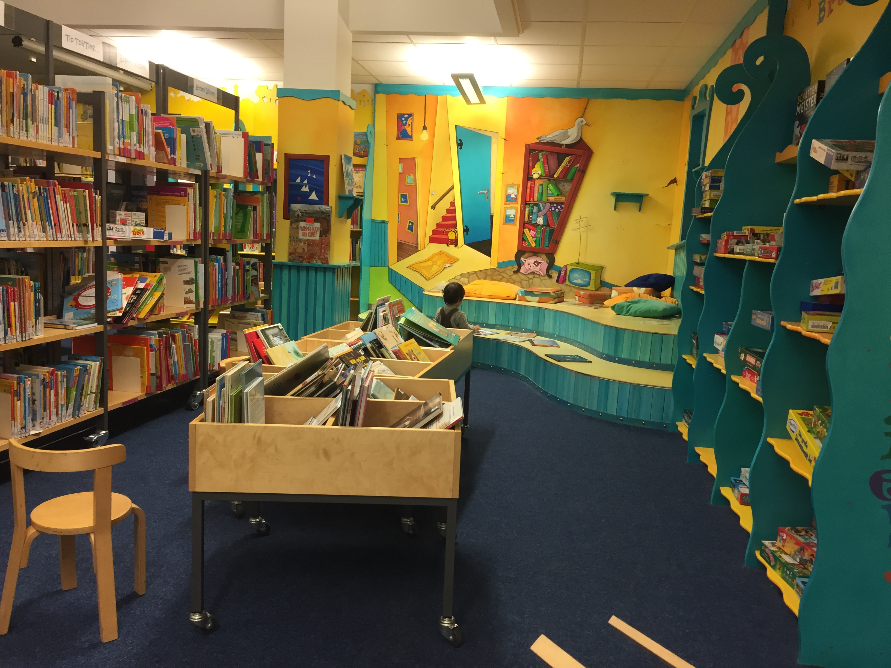
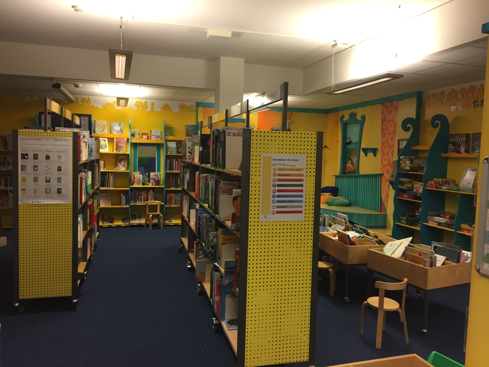
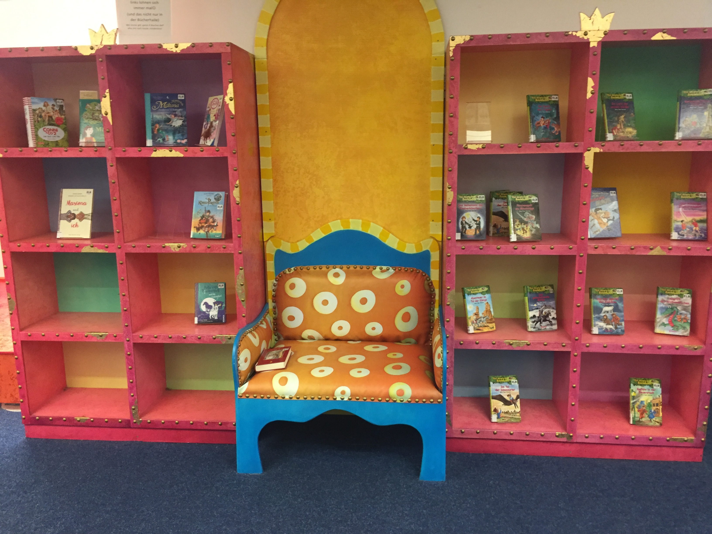
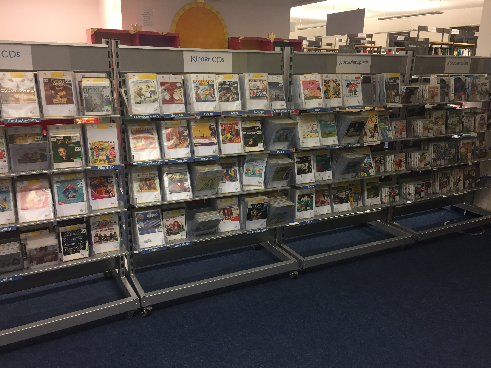
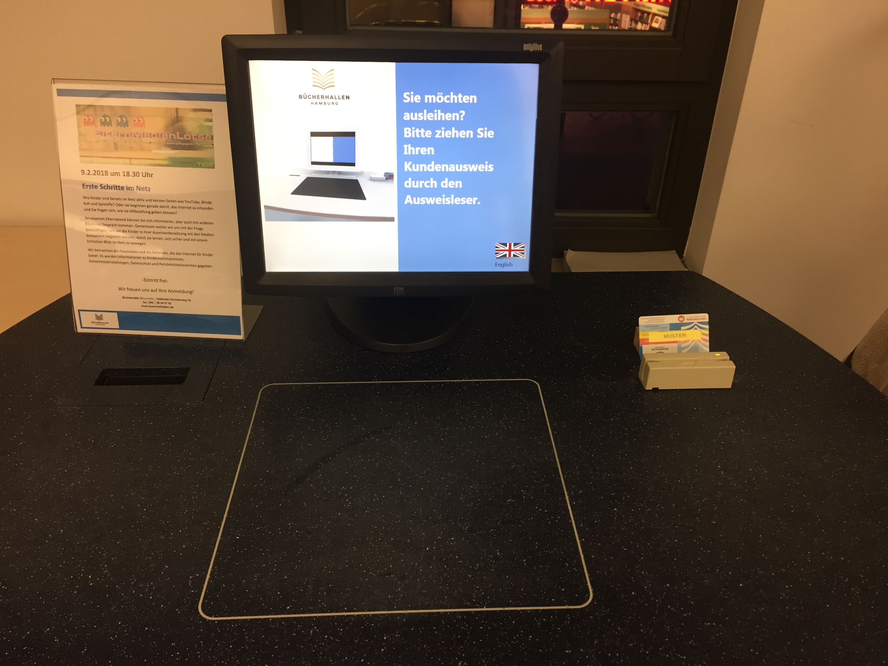

搬家后还没找到幼儿园，我就开始寻找附近的图书馆了。幼儿园没有太多挑选余地，但图书馆就不同了。德国每个城市都有大量图书馆，每个馆里都有专门为孩子设置的KinderBibliothek（简称KiBi），只不过根据当地政府收入（区域、城市）不同，图书馆的设施略有差异。

离我们最近的一个图书馆，在一个购物中心里。（此购物中心极其朴素，如果我们的购物中心是2.0版本，这个购物中心只有0.2）每天上下午各开门两小时，周日休息。去过一次，工作人员不热心、时间也不灵活。我于是继续选择去稍远一点的另一个区图书馆。

这个图书馆可以说依山而建。非常小的一座山包，上面有座小小的宫殿式建筑，门口是罗马圆柱。里面是汉堡的一所音乐学院。图书馆就在小山旁边的楼里。一进去我就傻眼了，太漂亮。门口是防盗门禁，进去有个小展台放着新书或当月主题推荐。借书、还书全部自动化。多媒体教室供活动使用、自修台上放着电脑、有台灯、充电插座。

图书馆进门处有6个小书架，放着不同杂志。从旅行、家居、美食到专业性更强的户外运动、电脑、火车。也有育儿、时尚、女性、男性……值得一提的是，德国有一类相当专业的测评杂志，内容无所不包，立场公正测评严谨，是生活需求非常好的指导。被评为优秀的产品，也会自豪的在包装印上测评等级标志。在书架上也能找到两种同类型的测评杂志。

每个图书馆都会有淘汰的书籍，因此，也有专门的书架用来做“跳蚤市场”。在这样的书架上，价格不会超过2欧、3欧，通常1欧可以淘到一些让人惊喜的旧书。跳蚤市场最大的乐趣是翻找和遇见。这里有旧书、CD、DVD、杂志等等。偶尔翻翻，惊喜不断。

在多媒体区域，包含了最新的电影DVD、大量的CD、有声书、连续剧。看到了让子弹飞的DVD十分惊喜，大片几乎都能借到。

我最关心的是儿童图书馆（KiBi）。 Kibi在图书馆最深处，大致分为两个区域，一部分是大孩子（6岁以上）的区域，和成人区域的布置几乎相同，只有墙面背景是深红色的，靠窗位置格外多放了几张红色沙发。书的分类也比较多：科学、技术、分级阅读、犯罪、奇幻……还有一个书架专门放DVD。

另一区域是小孩子的，我第一眼就喜欢上了这里，由衷羡慕德国的孩子们。书架是由铺在地上的盒子组成的，每个只有40厘米高，开口朝上。即使是刚会走路的孩子，也可以靠着翻找自己喜欢的书。四壁墙面画上了鲜艳有趣的图案，两个书架间还摆了张彩色座椅。站着的书架也有两排，不到一人高，方便大孩子取书。在墙角有一个两层的小舞台，孩子们脱了鞋在上面蹦蹦跳跳，或者坐在台阶上看书、玩桌游都很惬意。靠舞台旁边，是整整两架桌游。2岁孩子可以玩的比较少，4岁以后到成人都有很多选择。

在KIBI的中间有一排两面的架子，按字母顺序放着DVD、CD、有声书和wii游戏。高度在孩子的视线内，成人要弯腰。

在靠窗的一面墙，有两台电脑。一台用来查询，一台用来借书。借书是无人操作，只需要刷卡后，将书的封面或背面放在指定区域白框里扫描，电脑就会显示出书的名字。所有扫描完成后，在屏幕上点“完成”。就会有一张清单从机器里吐出来。上面写着书名、借阅日期和归还日期。

书籍的借阅日期是一个月，CD和DVD的日期是一周。但是到期前会有邮件通知，如果需要延长，可以在网上登录电子图书馆，延长借阅期限。

借书证号就是网上图书馆账户。凭借账户还能借阅电子书，查询许多信息。成人借书证可以借阅所有内容，每年20欧。儿童借书证只能借阅儿童读物，我毫不犹豫的办了成人借书证。

在KiBi的尽头，还有一间屋子。屋里有乐高、毛绒玩具、投影设备、彩色坐垫和凳子。每周固定时间在这间屋子里会有读书活动。每回节日临近，还会有相应的节日手工。孩子们冬天一起剪窗花，搭姜饼小屋，复活节一起做彩蛋和兔子……

书架上的书籍种类很多，除了常见的童书之外，德国的tipo点读笔和相关读物也可以借。图书分类大致包含天文、地理、物理、机械、生活、手工、艺术、动物这些类别，也有各种漫画、不同语言的童书、电子科技。我在书架上发现一本《儿童学Python很容易》，借回来也津津有味的照着写了几句代码。

儿童图书馆最让我觉得贴心的小细节和书无关，却是所有人都在意的安全问题。

儿童图书馆区域内所有的窗户，都没有把手。如果要开窗，必须用钥匙。这样，就完全杜绝了孩子自己爬上凳子开窗带来的安全隐患。

在汉堡市的中心图书馆，整个一楼都是儿童图书馆，面积之大，我们常常在里头玩上半天还意犹未尽。除了书籍，还有一个很大的多媒体管，除了常见的DVD、CD，还有pad供孩子们试用，常常有最新的图书展出，比入用pad帮助阅读的3D版童书。

德国的图书价格比起中国，实在是太贵了。但德国的图书馆到处都是、常去常新。
德国政府不遗余力的大力推广阅读，我们在多特蒙德居住时，每隔几个月会收到图书馆的免费赠书和阅读说明。告知家长阅读的重要性及如何给孩子读书。不同城市不同地域的做法也许不同，但目的都是为了让家长重视阅读、让孩子们爱上读书。

图书馆入门是免费的，没有借书证也可以随便进来。带孩子来疯跑一阵，然后找一个舒服的彩色座位，把鞋子脱了靠在图书馆提供的柔软的靠垫上，一起翻翻书。不认识字也有许多熟悉的人物，比如咕噜牛、毛毛虫。翻翻比笔记本电脑还大的无字书、有动物叫声的有声书……带孩子感受徜徉在丰富多彩的书的海洋里，实在是满足有趣。

